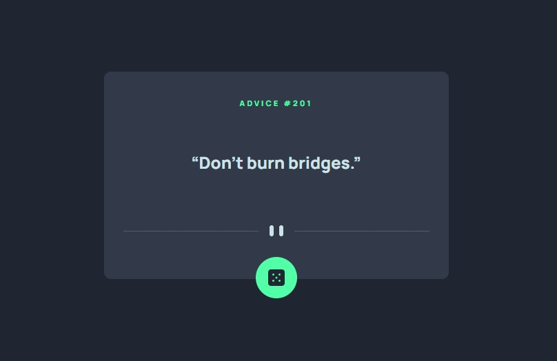

# Frontend Mentor - Advice generator app solution

This is a solution to the [Advice generator app challenge on Frontend Mentor](https://www.frontendmentor.io/challenges/advice-generator-app-QdUG-13db). Frontend Mentor challenges help you improve your coding skills by building realistic projects.

## Table of contents

- [Overview](#overview)
  - [The challenge](#the-challenge)
  - [Screenshot](#screenshot)
  - [Links](#links)
- [My process](#my-process)
  - [Built with](#built-with)
- [Author](#author)

## Overview

### The challenge

Users should be able to:

- Generate new advice everytime they click the dice;

### Screenshot

### Links

- Live Site URL: 

## My process

### Built with

- Semantic HTML5 markup
- CSS custom properties
- Flexbox
- Mobile-first workflow
- [Axios](https://github.com/axios/axios) - JS library

### What I learned

- How to send a request using fetch or axios properly.

## Author

- Frontend Mentor - [@BrazilianMemeMaster](https://www.frontendmentor.io/profile/brazilianmememaster)
- Twitter - [@MemeMaster_xd](https://www.twitter.com/mememaster_xd)
